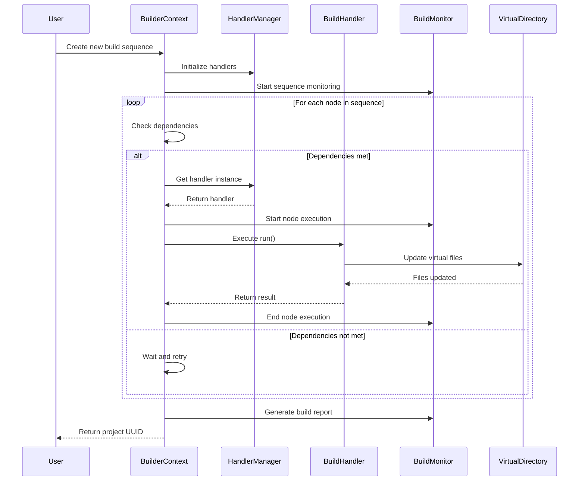
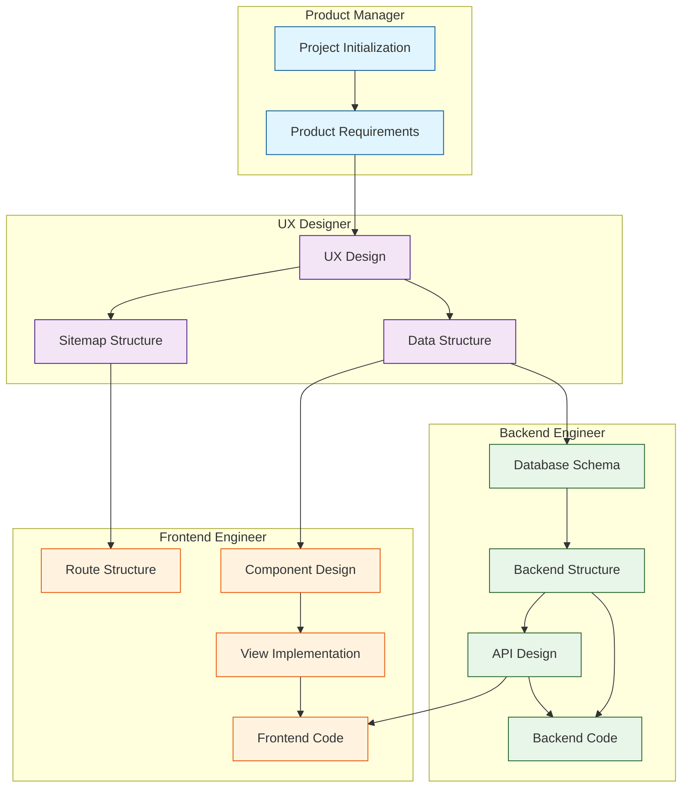

# CodeFox


Welcome to CODEFOX! A next generation AI sequence full stack project generator with interactive chatbot.

## ⚠️ Experimental Stage

> **Note**: This project is currently in experimental stage and will start workflow to agent mode refactoring.

## Demo

https://github.com/user-attachments/assets/8c588e83-b155-445c-bfa7-ed67fb57e77f

## Key Features

💻 **Transforming Ideas into Projects**
🚀 **Extraordinary Modeling System**: Integrates an AI model to seamlessly connect every aspect of your project.
🤖 **Multi-Agent Generator**: Create and manage multiple intelligent agents to enhance project functionality.
⚡ **One-Click Deployment**: Deploy your project effortlessly to cloud services or clone it locally with ease.
✨ **Live Preview**: Interact with your project while engaging in AI-powered conversations to make real-time modifications.
🔧 **Precise Code Customization**: Leverage targeted and efficient visual tools for precise module adjustments.

## Quick start

Node.js >= 18 and pnpm. Nothing else — no database to install, no tmux.

```bash
git clone <repository-url>
cd codefox
pnpm install
pnpm dev
```

`pnpm dev` generates `backend/.env` and `frontend/.env` on first run (with
fresh JWT secrets), then starts both servers:

- Frontend — http://localhost:3000
- Backend GraphQL — http://localhost:8080/graphql

Data lands in a SQLite file at `.codefox/data/codefox.db`. To use PostgreSQL
instead, set `DATABASE_URL` to a `postgresql://` URL in `backend/.env`; any
other value (or none) keeps SQLite.

To use chat, put an [OpenRouter key](https://openrouter.ai/keys) in
`backend/.env` as `OPENROUTER_API_KEY`. Configured models:

- **Claude Sonnet 4.5** (default) — `anthropic/claude-sonnet-4.5`
- **GPT-4o-mini** — `openai/gpt-4o-mini`

### Other dev commands

```bash
pnpm dev:tmux      # same stack in a tmuxinator session (needs tmux + tmuxinator)
pnpm demo:record   # re-record the landing-page demo against the running app
```

Start services individually with `pnpm dev` inside `backend/` or `frontend/`.

## Architecture Overview

CodeFox consists of two main components that work together:

```
        +-------------+
        |  Frontend   |
        | (Next.js)   |
        +------+------+
               |
               | GraphQL
               |
        +------v------+
        |  Backend    |
        | (NestJS)    |
        +------+------+
               |
               | OpenAI API
               |
        +------v------+
        | OpenRouter/ |
        |   OpenAI    |
        +-------------+
```

- **Frontend (Next.js)**: Provides the user interface and handles client-side logic
- **Backend (NestJS)**: Manages business logic, authentication, project generation, and AI model interactions

### Build System Architecture

The backend includes a sophisticated build system that manages project generation through a sequence of dependent tasks. Here's how it works:



Key components:

1. **BuilderContext**

   - Manages the execution state of build nodes
   - Handles dependency resolution
   - Coordinates between handlers and virtual filesystem

2. **BuildHandlerManager**

   - Singleton managing handler instances
   - Provides handler registration and retrieval
   - Manages handler dependencies

3. **BuildHandler**

   - Implements specific build tasks
   - Can declare dependencies on other handlers
   - Has access to virtual filesystem and model

4. **BuildMonitor**

   - Tracks execution progress
   - Records timing and success/failure
   - Generates build reports

5. **VirtualDirectory**
   - Manages in-memory file structure
   - Provides file operations during build
   - Ensures atomic file updates

### Full-Stack Project Generation Workflow

The build system follows a structured workflow to generate a complete full-stack project:



## Troubleshooting

### Common Issues

1. **Port Conflicts**

   - Ensure ports 3000, 8080, and 3001 are available
   - Check for any running processes: `lsof -i :<port>`

2. **Environment Issues**

   - Verify all environment variables are properly set
   - Ensure model path is correct in LLM server configuration
   - Verify model configurations in .codefox/config.json:
     - Check model identifiers are correct
     - Validate endpoint URLs for cloud-based models
     - Ensure API tokens are valid
     - Verify local model paths for non-cloud models

3. **Build Issues**

   ```bash
   # Clean installation
   pnpm clean
   rm -rf node_modules
   pnpm install

   # Rebuild all packages
   pnpm build
   ```

4. **Tmuxinator Issues**
   - Ensure Tmux version is >= 3.2: `tmux -V`
   - Kill existing session: `tmux kill-session -t codefox`
   - Check session status: `tmux ls`

## Additional Resources

- [API Documentation](./docs/api.md)
- [Contributing Guidelines](./CONTRIBUTING.md)
- [Change Log](./CHANGELOG.md)

## Support

For support and questions:

- GitHub Issues: [Create an issue](https://github.com/your-repo/issues)
- Documentation: [CodeFox Docs](./codefox-docs)

## License

ISC
