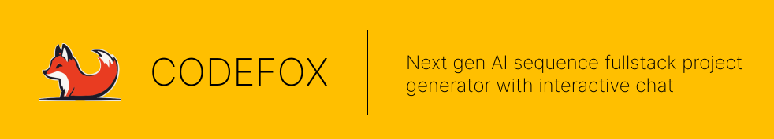
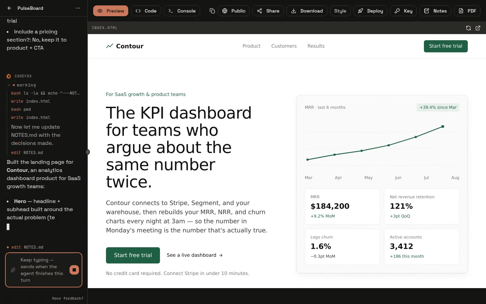
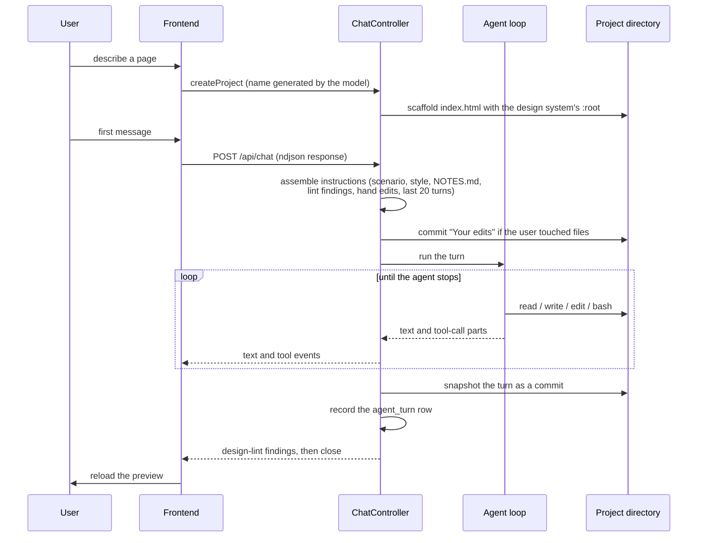

# CodeFox



Describe a page in a sentence. CodeFox scaffolds it on your disk, hands the
directory to a coding agent, and renders the result beside the chat — so what
you are looking at is the file the agent just wrote, not a picture of it.

## Demo

One prompt on the landing page, the questions the agent asks before it builds,
the build itself, and the page it wrote. Recorded against a local run with
`pnpm demo:flow`, so it is the product as it stands today rather than a
mockup — re-run it after a UI change and the demo is current again.

The two stretches where a human would only be watching the agent work are sped
up and say so on screen; everything else is real time.

[](assets/demo.mp4)

## What it does

**It asks before it builds.** On the first message of a project the agent
answers with a question block instead of files — audience, visual direction,
call to action — and the UI renders it as a card, with the design systems as
colour swatches. Answer or skip; it asks once per project.

**The preview is the file.** A page project renders the HTML the agent just
wrote; a `next` project gets a real `next dev` server on its own port. Both
update as the turn runs.

**Every turn is a commit.** The project directory is a git repo. Each turn
snapshots, so the workbench can show what changed and restore the tree to any
earlier turn — including your own hand edits, which are committed as "Your
edits" before the agent starts.

**The project remembers.** Only the last 20 turns are replayed to the agent,
so decisions go in a `NOTES.md` the agent keeps and reads back in full every
turn. It never leaves the machine: `NOTES.md` is the one file the deploy and
share paths refuse to publish.

**Restyle without rewriting.** The design system lives in one `:root` block of
CSS variables; picking a different one swaps the tokens, not the markup.

**Ship it.** Publish a share link, download a zip, export a PDF, or deploy a
page to your own Vercel account in a single API call. Public projects land on
a wall others can remix, with attribution back to the original.

## Quick start

Node.js >= 18 and pnpm. Nothing else — no database to install, no tmux.

```bash
git clone https://github.com/CodeFox-Repo/codefox.git
cd codefox
pnpm install
pnpm dev
```

`pnpm dev` generates `backend/.env` and `frontend/.env` on first run (with
fresh JWT secrets), then starts both servers:

- Frontend — http://localhost:3000
- Backend GraphQL — http://localhost:8080/graphql

Data lands in a SQLite file at `.codefox/data/codefox.db`. To use PostgreSQL
instead, set `DATABASE_URL` to a `postgresql://` URL in `backend/.env`; any
other value (or none) keeps SQLite.

To use chat, put a key in `backend/.env` as `LLM_API_KEY` — any
OpenAI-compatible endpoint works, set `LLM_BASE_URL` to point at it.
An [OpenRouter key](https://openrouter.ai/keys) with the default base url is
the zero-config option, and `OPENROUTER_API_KEY` is still read as a fallback.
Configured models (override with `LLM_MODELS`):

- **Claude Sonnet 4.5** (default) — `anthropic/claude-sonnet-4.5`
- **GPT-4o-mini** — `openai/gpt-4o-mini`

That key drives the default in-process agent. To run against a coding CLI
instead — including one already logged in on your machine — see
[Which agent runs](#which-agent-runs).

### Other dev commands

```bash
pnpm dev:tmux      # same stack in a tmuxinator session (needs tmux + tmuxinator)
pnpm demo:record   # re-record the landing-page demo against the running app
pnpm demo:flow     # re-record the README demo — drives a real build, so it
                   # needs a working LLM key and spends tokens
```

### Checks

```bash
pnpm check                     # ~13s — guards against regressions, also a CI step
pnpm --filter codefox-backend test   # ~8s — backend unit tests
```

`scripts/check-*.mjs` are dependency-free assertions about real source text,
each written so that reverting the fix it guards makes it fail. They exist
because most of what they cover is a branch that only runs when something is
already broken, which an ordinary test run never reaches.

`scripts/visual-qa*.mjs` drive a real browser and are deliberately **not** in
`pnpm check` — they need a running stack. See the header of each for usage.

Start services individually with `pnpm dev` inside `backend/` or `frontend/`.

## Architecture Overview

```
        +-------------+
        |  Frontend   |   Next.js — workbench, preview, question cards
        | (Next.js)   |
        +------+------+
               |
               |  GraphQL for state, one ndjson stream per turn
               |
        +------v------+
        |  Backend    |   NestJS — auth, projects, quota, telemetry
        | (NestJS)    |
        +------+------+
               |
               |  agent loop: file + shell tools, in the project directory
               |
        +------v------+        +--------------------+
        | Agent        |------->| LLM endpoint       |
        | (AI SDK /    |        | OpenAI-compatible  |
        |  claude-code |        +--------------------+
        |  / codex)    |
        +------+------+
               |
               |  writes real files
               |
        +------v------+
        | Project dir  |  .codefox/projects/<id>, a git repo
        +-------------+
```

- **Frontend (Next.js)** — the workbench: chat, preview, file tree, console,
  and the toolbar (share, download, PDF, deploy, restyle, notes).
- **Backend (NestJS)** — accounts and sessions, project and chat ownership,
  quota, the preview servers, and one `agent_turn` row per turn for telemetry.
- **Agent** — an in-process loop by default; the coding CLIs are alternatives,
  not the default. See [How a turn runs](#how-a-turn-runs).

### How a turn runs



The first turn of a project usually ends without touching a file: the agent is
told to answer with a `codefox-questions` block instead, which the UI renders
as the question card. Answering sends the choices as the next message, and
that turn builds.

### Which agent runs

`AGENT_HARNESS` picks the loop. All three see the same project directory and
emit the same stream parts, so the rest of the backend does not know which ran.

| value | what it is | needs |
| --- | --- | --- |
| unset / `aisdk` (default) | in-process AI SDK loop — `streamText` plus read/write/edit/append/list/bash tools | `LLM_API_KEY` for any OpenAI-compatible endpoint |
| `claude-code` | the Claude Code CLI, embedded through the AI SDK harness | `ANTHROPIC_API_KEY`, or `ANTHROPIC_BASE_URL` at an Anthropic-compatible endpoint |
| `codex` | the Codex CLI, same harness | an OpenAI-compatible endpoint, including aggregators |

The default is in-process for a reason: the CLI harnesses speak
`/v1/responses`, and aggregators translate that protocol imperfectly — 500s
from one provider, corrupted reasoning signatures from another, and a turn
that never produces a token. Plain `chat/completions` is served natively
everywhere, so that class of failure does not exist on the default path.

A model id may name its own provider with an `@suffix`
(`LLM_MODELS=gpt-5-mini,claude-sonnet-5@cpa` plus `LLM_BASE_URL_CPA` and
`LLM_API_KEY_CPA`), which is how one deployment serves models that do not
share a host.

### Where the agent runs

`SANDBOX_PROVIDER` picks the sandbox.

- **`host` (default)** — the project directory on the backend's own disk,
  under `.codefox/projects/<projectPath>`. Zero setup, and the preview is a
  local dev server, which is what makes `pnpm dev` work with nothing
  installed. It is **not** isolation: the agent's shell has the backend
  process's privileges. Safe for your own laptop, wrong for untrusted users.
- **`vercel`** — a real microVM per session (`@vercel/sandbox`), which is what
  multi-tenant needs, since there a prompt is untrusted input. Needs
  `VERCEL_PROJECT_ID` and a token.

Page (`html`) projects always run on the host: they are files the preview
reads directly, with no dev server to boot.

## Troubleshooting

**"Error creating the project" right after you hit Create.** The backend log
says `OpenAI API key is missing`. Naming a project is a model call, so it
fails before the agent ever runs — set `LLM_API_KEY` (or `OPENROUTER_API_KEY`)
in `backend/.env` and restart. `.env` is read at boot; the watcher does not
reload it.

**The turn ends immediately with "The agent has no credentials".** Same cause,
different call site: the agent loop needs `LLM_API_KEY` pointing at whatever
`LLM_BASE_URL` serves. With `AGENT_HARNESS=claude-code` it is
`ANTHROPIC_API_KEY` instead.

**Port conflicts.** 3000 (frontend) and 8080 (backend) are fixed; the rest are
not. A `next` project's preview takes a free ephemeral port per project, and
in `host` mode the CLI harnesses lease a bridge port from 3001-3003 — three,
which also caps how many agent sessions one project can run at once. Find the
holder with `lsof -i :<port>`.

**A clean rebuild.**

```bash
rm -rf node_modules
pnpm install
pnpm build
```

**Starting over.** All local state lives in `.codefox/`: the SQLite database
in `data/`, the generated projects in `projects/`, uploads in `media/`.
Deleting the directory resets everything, including your account. Deleting a
single project directory leaves a row pointing at nothing, so prefer deleting
the project in the UI.

**tmux.** `pnpm dev:tmux` needs tmux >= 3.2 (`tmux -V`) and tmuxinator. If a
session is stuck: `tmux kill-session -t codefox`. Plain `pnpm dev` needs
neither.

## Additional Resources

- [DEPLOY.md](./DEPLOY.md) — deploying CodeFox itself: frontend on Vercel,
  backend on Railway (it cannot be serverless — a turn streams for minutes)
- [HANDOFF.md](./HANDOFF.md) — session-by-session engineering log: what was
  found, what was fixed, what is still open. Long, and the most honest
  description of the system's state.
- [docs/RSI-SIGNALS.md](./docs/RSI-SIGNALS.md) — whether a good turn can be
  told from a bad one using data CodeFox already records, and what the
  `agent_turn` rows are for
- `scripts/` — every check, probe and recorder, each with a header explaining
  what it guards and how to run it

## Support

- Issues: [github.com/CodeFox-Repo/codefox/issues](https://github.com/CodeFox-Repo/codefox/issues)

## License

[MIT](./LICENSE).
