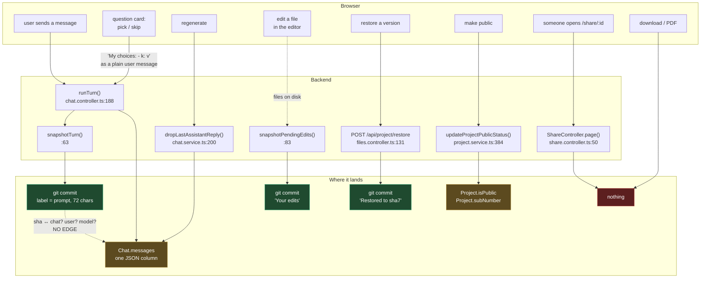

# Turn-outcome signals

Can we tell a good agent turn from a bad one, from data CodeFox already has?

**Yes — cheaper than expected, and blocked by one thing that is not the thing it
looks like.**

CodeFox has something kobe does not: a human verdict that nobody asked the agent
for. Every turn commits (`chat.controller.ts:63`), and the user can put the files
back (`host-workspace.ts:160`). A restore is a rejection, and it was not
self-reported.

The surprise is that a restore is **already recorded** — as a commit labelled
`Restored to <sha7>`. Across the 103 project repos on the dev box: 50 restore
commits, 27 turn commits provably rolled back. The negative signal is not being
lost. It is being written to a store that has no reader and no join key.

That reframes the first step. It is not "instrument restore". It is **give a turn
an identity**, because right now a version sha cannot be connected to the chat,
the user, the model or the prompt that produced it — and "which turns are bad" is
unanswerable without that edge, no matter how many events you log.

---

## Where signals are born, and where they die



The dashed edge is the whole problem. Everything above it is real, durable data.
Nothing crosses.

---

## Signal inventory

| Signal | Meaning | Where it is now | Persisted? | Attributable to |
|---|---|---|---|---|
| Turn snapshot | a turn happened and changed files | git commit, label = prompt truncated to 72 chars (`chat.controller.ts:66`) | yes | version sha; prompt only fuzzily |
| **Restore** | **human rejected a turn** | git commit `Restored to <sha7>` (`host-workspace.ts:184`) | **yes** | target sha; rolled-back range inferable |
| `Before restore` | tree was dirty when restoring | git commit, conditional | rarely (2 of 50 observed) | — |
| **`Your edits`** | **human hand-fixed the agent's output** | git commit `Your edits` (`chat.controller.ts:91`) | **yes** | the turn that follows it |
| **Regenerate** | **human rejected a reply** | `isDeleted: true` on a trailing assistant message (`chat.service.ts:216`) | **yes** | message id |
| Question card answered | which options the user picked | a plain user message, `My choices:\n- <label>: <option>` (`question-card.tsx:126`) | yes, in `Chat.messages` | message id; option *text*, not id |
| Question card skipped | user declined to steer | fixed string `Use your best judgment…` (`question-card.tsx:199`) | yes | message id |
| Turn errored | the harness or provider failed | `{t:'error'}` on the wire, `logger.error` | **no** — log line only | nothing |
| Tool calls in a turn | how much work the turn did | `TurnStep[]` on the assistant message | yes, when the client saves it | message id |
| Model used | which model ran this turn | `Chat.model`, **mutable**; `chatDto.model` can override per request | **no, not per turn** | wrong on any chat that switched models |
| Project made public | user is proud of it | `Project.isPublic` boolean; `updatedAt` bumped by anything | boolean only, no event | project, no time |
| Fork count | others copied it | `Project.subNumber` counter | count only, no event | project, no time |
| **Share page viewed** | **someone outside saw it** | `share.controller.ts:50` | **no** — not counted, not logged | nothing |
| Download / PDF export | user took it away | `downloadController.ts:16`, `screenshot.controller.ts:144` | **no** | nothing |
| Agent run bridge log | harness-internal transcript | `.codefox/projects/.agent-runs/<id>/bridge/` | yes, on disk | **nothing** — see corpus verdict |

Three rows carry a human verdict and are already on disk: **restore**, **`Your
edits`**, **regenerate**. None of them has ever been read.

---

## What a turn is, and why nothing joins

Three candidate identities exist. None works alone.

**Version sha.** Real, stable, and the only id the rejection signal points at.
But it carries no chat, no user, no model — only a 72-char prompt prefix. Two
identical prompts collide. And `snapshot()` returns `null` when a turn changed
nothing, so a turn that only answered a question has no sha at all.

**Message id.** `${chatId}/${index}` (`chat.service.ts:278`). Stable and unique —
the index counts soft-deleted messages too, so ids are never reused. But the
assistant message is normally saved *by the browser*, and the sha is minted in
`runTurn`'s `finally` (`chat.controller.ts:349`) after the stream has already
closed. The two never meet.

**Agent run id.** The bridge directory name. Generated inside the harness, never
surfaced to CodeFox code, never persisted. `session.id` exists on the object and
is dropped. Not joinable, at all.

So the join key does not exist. Whatever is built first has to create it.

### The gotcha for anyone building on `snapshot()`

`HostWorkspace.snapshot` gates on `changedFiles()`, which diffs against the
**root commit**, not HEAD (`host-workspace.ts:133`, and the comment at `:88`
explains why that is right for the Changes panel). After the first turn that set
is never empty, so a snapshot of a clean tree still runs `git commit`, fails, and
returns `null` through the catch with a warning. Correct outcome, misleading
route. `VercelWorkspace.snapshot` gets this right with `status --porcelain | grep
-q .` (`vercel-workspace.ts:100`). Do not read "snapshot returned null" as "no
git" — and if a digest ever counts those warnings, it is counting noise.

---

## Gaps, ranked by cost

### Tier 0 — no new code, only a reader

These are already on disk. A digest can read them today.

1. **Restores, and what they rolled back.** Walk each project's `git log` oldest
   first; for each `Restored to <sha7>`, the rejected set is every non-bookkeeping
   commit between that target and the pre-restore HEAD. Verified against the dev
   box: 27 rolled-back turns out of 62.
2. **Hand edits.** A `Your edits` commit means the previous turn's output was not
   good enough to leave alone.
3. **Regenerates.** Soft-deleted trailing assistant messages in `Chat.messages`.
   Weaker than restore — the files are not rolled back, so it rejects the *reply*,
   not the code — but it is free and non-self-reported.
4. **Question card answered vs. skipped.** Regex the user message. Lossy (option
   text, not id) and good enough to answer "does asking help".

**Hard limit on Tier 0: it only works in host mode.** In `SANDBOX_PROVIDER=vercel`
the git history lives inside a per-project microVM. Reading it means resuming
every sandbox — one paid cold start per project, ×155 and growing. If production
runs vercel mode, a pure-read digest is a dev-box tool only, and Tier 1 is not
optional.

### Tier 1 — one row per turn (small, and it unblocks everything)

`runTurn`'s `finally` block already holds, in scope: `project.projectPath`,
`chatDto.chatId`, `chatDto.model`, `project.template`, the sha `snapshotTurn`
throws away, the step count, and whether an error frame was seen. One insert
there creates the join key that nothing else has.

Notably this is the **only** way to get per-turn model attribution. `Chat.model`
is mutable (`updateChatModel`) and `chatDto.model` overrides per request, so any
"which model produces rejected turns" question answered from the chat row is
answered wrong the moment someone switches models mid-project.

Doing it backend-side avoids threading a sha through the ndjson stream, the
`ChatInput` DTO, and the frontend save path. Prefer it for that reason alone.

### Tier 2 — one row per restore

The controller (`files.controller.ts:131`) has the user, the project and the
target sha; the workspace has HEAD. The git label already tells you a restore
happened, so the marginal value is: **who** did it, the exact time, and the
degenerate case where the restore was a no-op and left no commit. Worth doing
after Tier 1, not before — without a turn table there is nothing to point at.

### Tier 3 — outcome signals that are 100% lost

Share views, downloads, PDF exports, publish-time, fork-time. Each is one counter
or one row. Share views are the strongest "this was worth something" signal in the
product and the only one on an anonymous route — which means bot traffic, and a
raw count that will lie. Do not build the positive side of the ledger on it
without at least a UA filter and a same-IP dedup window.

### Deployment cost, stated up front

The repo carries **no migrations** and relies on `synchronize`
(`database.config.ts`). Production defaults `DB_SYNCHRONIZE` off. Any new entity
in Tier 1–3 therefore needs a deliberate one-off `DB_SYNCHRONIZE=true` deploy, on
a database where synchronize will also happily drop a column to match an entity.
That is the real cost of Tier 1, not the twenty lines of code.

---

## Proposed positive/negative definition

Negative, in strength order — all three are human, none is self-reported:

- **rejected** — a restore covers this turn's sha
- **patched** — a `Your edits` commit follows this turn
- **retried** — this turn's reply was regenerated away

Positive is weaker and always inferential. For v1:

- **survived** — no restore covers it, and at least one later turn exists in the
  project

That is deliberately modest. "Survived" mostly means "the user kept going", which
is a low bar. Publish / share / download would make it a real positive, and all
three are Tier 3 — so **v1 has a sharp negative and a blunt positive**, and any
metric built on it should be read as a rejection rate, not a success rate.

Ceiling worth naming: a project abandoned after one turn produces neither signal.
Silence is the most common outcome and it is invisible to this scheme.

---

## `digest` interface sketch — not implemented

Deliberately modelled on kobe's `digest`: a pure aggregating read over data that
already exists, shipped before anything that writes.

**In**

```
codefox digest [--since <iso>] [--project <path>] [--json]
```

No arguments = every project the backend can see. Reads git history and the
`Chat`/`Project` tables. Writes nothing.

**Out**

```
turns          142   snapshots that are not baseline/bookkeeping
  rejected      27   a restore rolled this turn back        (19%)
  patched        9   user hand-fixed the output afterwards   (6%)
  retried        4   reply regenerated away                  (3%)
  survived     102   still standing, project continued      (72%)

by template    html 88 (21% rejected) · next 54 (16% rejected)
by model       UNRELIABLE — see Tier 1
question card  asked 31 · answered 22 · skipped 9
               answered → 11% rejected · skipped → 34% rejected
unattributable 19   turns with no sha, or sha with no chat
```

**Decisions each number is allowed to inform**

- `rejected %` — the ruler itself. Nothing downstream is meaningful until this
  has a stable baseline over real traffic.
- `by template` — is the html path actually better than the Next.js one? The
  product has bet on it; nothing has checked.
- `question card answered vs skipped` — planner earns its turn, or does not.
- `unattributable` — the honesty column. If it is large, every other row is
  guesswork and the digest should say so rather than round it away.

`by model` is listed and explicitly marked unreliable rather than omitted,
because it is the number everyone will want first and the one the current data
cannot honestly produce. That is Tier 1's whole justification.

---

## What not to do

**Do not tune prompts against outcome weights.** With 62 turn commits of
synthetic data and no reliable model attribution, any prompt change "validated"
by rejection rate is fitting noise. This is the exact failure kobe's PR #385
concluded against: a mechanism without a ruler is astrology. A ruler with n=62
and a broken join is astrology with error bars.

**Do not build a rejection→memory loop yet.** kobe earned its field notes by
having a digest first. The equivalent here — feeding "you were restored last
time" into the next turn's prompt — is one step past where the data is. It also
has a failure mode kobe's does not: a restore can mean the agent was wrong, or
that the user changed their mind. Nothing distinguishes them, and a memory built
on the second kind actively teaches the agent the wrong lesson.

**Do not treat `finishReason: 'stop'` as success.** It appears in 133 of 143
bridge logs and means the model stopped emitting tokens. It is the self-report
CodeFox specifically does not need.

**Do not instrument restore first.** It is already in git. Building the audit row
before the turn table produces a precise record of rejections that still cannot be
attributed to anything.

**Do not add an analytics SDK.** There is none today (confirmed: no PostHog,
Segment, Amplitude, or equivalent anywhere in `backend/src` or `frontend/src`; the
admin console does live `count()` queries). Every signal here is first-party and
already in the process. A vendor would add a network dependency, a consent
surface, and a second source of truth, to answer questions two SQL queries answer.

---

## Corpus verdict: the 143 agent-runs are not a baseline

Checked read-only under `/Users/jacksonc/i/codefox/.codefox/projects/.agent-runs/`.
Uniform shape: `bridge/{bridge-meta,start-config,rerun-start-config}.json` and
`event-log.ndjson`, all 143. Clean, parseable, and unusable. Three reasons, any
one fatal:

**No join key.** `start-config.json` has exactly five fields — `type`, `prompt`,
`tools`, `model`, `permissionMode`. No project, no chat, no user, no cwd, no
timestamp (only file mtime). The directory name is harness-generated and appears
nowhere in CodeFox's own data. There is no way to ask what any of these runs
produced.

**No outcome.** Event types across all 143 logs: `finish-step` 1151, `tool-call`
924, `tool-result` 924, `text-*` 674, `file-change` 150, `stream-start` 143,
`finish` 133, `error` 1. Nothing about whether the result was kept. The one
`error` is a transport blip.

**It is test fixtures.** 126 of 143 prompts match `scripts/e2e-nodes.mjs`
verbatim — `PERSISTENCE PROBE`, `Hand Edit Check`, `把页面做成中英双语的打招呼页`,
`Read every file under src`. Of the ~17 remainder, most are hand-run probes
(`SYMLINK PROBE`, `context wire check`, `My favourite colour is teal`). Roughly
three look like a real user typing.

The git histories are better data and hit the same wall: 103 repos, 62
non-bookkeeping turn commits, and the same e2e prompts. (43 of the 146 project
directories have no `.git` at all — scaffold's baseline failed, or they were never
host-mode — so even that floor is soft.)

**There is no historical corpus. The baseline starts the day something reads
these signals.** Which is an argument for shipping the Tier 0 reader now, cheap
and imperfect, rather than a good one later: it costs nothing and it starts the
clock.
